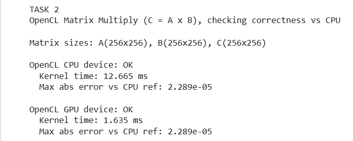

# Practical_Work6

## Таск 1. 

В первом задании реализовано кросс-платформенное приложение, выполняющее операцию поэлементного сложения двух массивов `A` и `B` с записью результата в массив `C`. Ядро OpenCL `vector_add` получает глобальный идентификатор `id` и вычисляет `C[id] = A[id] + B[id]`. Для корректности добавлена проверка границы `id < n`, чтобы ядро не выходило за пределы массива.

Программа последовательно выполняет вычисления для трёх размеров входных данных: **10 000**, **100 000** и **1 000 000** элементов. Для сравнения производительности измеряется время выполнения на CPU (обычный последовательный цикл на C++), а также время выполнения OpenCL-ядра на CPU-устройстве и GPU-устройстве. В конце выводится таблица и ASCII-график, демонстрирующий зависимость времени от размера массива.

Результаты выполнения программы представлены на скриншоте:

  

  

**Заключение по результатам:** при увеличении размера массива преимущество GPU становится более заметным, так как параллельное выполнение лучше масштабируется. CPU-вариант (последовательный) остаётся простым, но быстрее упирается в ограничение по производительности одного потока. OpenCL позволяет запустить одно и то же ядро на разных устройствах и наглядно сравнить их скорость.

## Таск 2. Параллельное умножение матриц (Matrix Multiply)

Во втором задании реализовано умножение матриц в OpenCL. Матрица `A` имеет размер `N×M`, матрица `B` — размер `M×K`, результат `C` — размер `N×K`. Ядро `matmul` использует двумерную глобальную сетку: `row = get_global_id(0)` и `col = get_global_id(1)`. Каждый work-item вычисляет ровно один элемент `C[row, col]` через сумму произведений по индексу `i` от `0` до `M-1`.

Для проверки корректности результат OpenCL сравнивается с последовательной реализацией умножения матриц на CPU. В консоль выводится максимальная абсолютная ошибка (Max abs error vs CPU ref). Если ошибка мала (порядка `1e-5` и меньше), результаты считаются корректными с учётом особенностей вычислений с float.

Результаты выполнения программы представлены на скриншоте:

  

  

**Заключение по результатам:** GPU показывает значительно меньшее время выполнения ядра по сравнению с CPU-устройством OpenCL, так как вычисление матричного произведения хорошо распараллеливается по элементам результата. Ошибка относительно CPU-эталона остаётся маленькой и связана с особенностями представления чисел с плавающей точкой и порядком суммирования.

---

# Контрольные вопросы

## 1. Какие основные типы памяти используются в OpenCL?

В OpenCL используются разные адресные пространства памяти: `__global` (глобальная память устройства), `__local` (локальная/разделяемая память внутри work-group), `__private` (приватная память work-item, аналог временных переменных/регистров), а также `__constant` (константная память только для чтения). В данной работе входные и выходные массивы передаются через `__global`, а промежуточные переменные хранятся в приватной памяти.

## 2. Как настроить глобальную и локальную рабочую группу?

Глобальный размер (`global size`) задаёт общее количество work-items, которые будут запущены. Локальный размер (`local size`) задаёт размер work-group (аналог блока потоков). В задаче сложения векторов глобальный размер равен `n`, чтобы покрыть все элементы. В задаче умножения матриц глобальный размер задаётся как двумерный `{N, K}`, так как каждый work-item вычисляет один элемент результата `C`. Локальный размер можно задавать вручную (например `16×16`), но в базовой версии можно оставить его `nullptr`, чтобы OpenCL выбрал автоматически.

## 3. Чем отличается OpenCL от CUDA?

CUDA — это платформа и язык для GPU NVIDIA, тесно привязанный к экосистеме NVIDIA. OpenCL — кросс-платформенный стандарт, который может работать на устройствах разных производителей (CPU, GPU, ускорители). В OpenCL код ядра компилируется во время выполнения (или через offline-компиляцию), а управление устройствами выполняется через платформы, устройства, контекст и командные очереди.

## 4. Какие преимущества даёт использование OpenCL?

Главное преимущество OpenCL — переносимость: одно и то же приложение можно запускать на CPU и GPU разных производителей. Это удобно для сравнения производительности и для разработки кросс-платформенных решений. Кроме того, OpenCL позволяет тонко управлять вычислениями и памятью (буферы, очереди команд, профилирование), что полезно для оптимизации параллельных программ.
